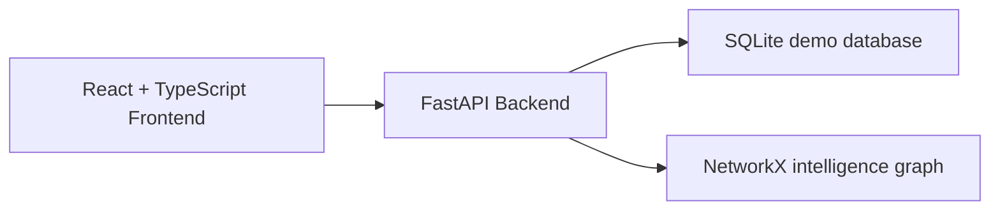

# CrimeCyclops — KSP Crime Intelligence Platform

A hackathon-friendly full-stack demo for a Karnataka State Police-style intelligence platform.

## Architecture



## Run locally

1. Backend
   ```bash
   cd backend
   python -m uvicorn app.main:app --reload
   ```

2. Frontend
   ```bash
   cd frontend
   npm run dev
   ```

3. Seed data
   ```bash
   curl -X POST http://127.0.0.1:8000/api/ingest/seed
   ```

## Demo scope

- Synthetic demo data generation
- Dashboard overview/endpoints
- Public safety aggregate view
- Network and alerts stub routes
- Multi-language UI labels

## Notes

- This repository uses SQLite for local demo readiness.
- The project is structured for later extension with PostgreSQL/PostGIS and richer analytics.
