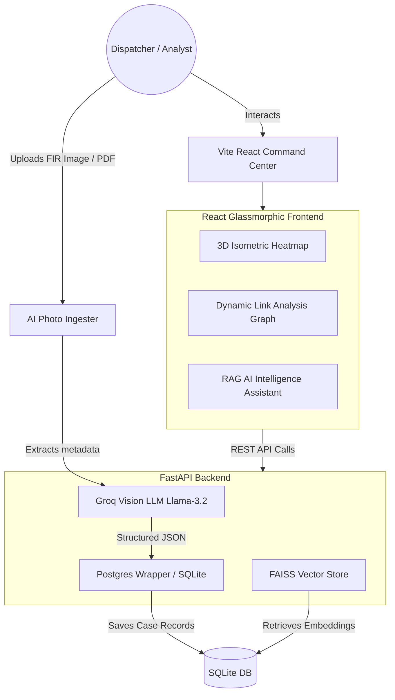

# 👁️ CrimeCyclops — Next-Gen Crime Intelligence & Command Center

*Designed for the KSP Datathon Hackathon. CrimeCyclops is a tactical command center that aggregates case intelligence, maps live spatial crime trends in 3D, performs link analysis between suspects, and parses paper case documents instantly using AI Vision.*

---

## 🚀 Presentation Video & Prototype
- **Live Demo Link**: [Deploy on Render](https://crimecyclops.onrender.com) *(Use admin / admin123 to log in)*

---

## 📖 The Problem
Police intelligence divisions are overwhelmed by fragmented data pools:
1. **Paper-heavy workflows**: Hours are wasted manual-typing physical FIR documents and case reports.
2. **Invisible Links**: Criminal networks remain hidden because manually connecting suspects, witnesses, and vehicles across multiple districts is nearly impossible.
3. **Flat, Static Mapping**: Conventional 2D crime maps lack direct visual hierarchy, failing to provide immediate spatial awareness to dispatchers.

---

## ⚡ The CrimeCyclops Solution
CrimeCyclops bridges the gap between physical documentation and predictive spatial action:


```mermaid
flowchart TD
    %% Users & Input
    User((Dispatcher / Analyst)) -->|Uploads FIR Image / PDF| Ingester[AI Photo Ingester]
    User -->|Interacts| UI[Vite React Command Center]

    %% Frontend & Visualizers
    subgraph UI_Panels [React Glassmorphic Frontend]
        3DMap[3D Isometric Heatmap]
        Network[Dynamic Link Analysis Graph]
        Chatbot[RAG AI Intelligence Assistant]
    end
    UI --> UI_Panels

    %% Backend Layer
    subgraph API_Backend [FastAPI Backend]
        Parser[Groq Vision LLM Llama-3.2]
        FAISS[FAISS Vector Store]
        DB_Layer[Postgres Wrapper / SQLite]
    end
    
    Ingester -->|Extracts metadata| Parser
    Parser -->|Structured JSON| DB_Layer
    UI_Panels -->|REST API Calls| API_Backend
    
    %% Storage
    DB_Layer -->|Saves Case Records| SQL_DB[(SQLite DB)]
    FAISS -->|Retrieves Embeddings| SQL_DB
```

---

## 🌟 Core Datathon Features

### 1. 📷 AI-Powered Photo Case Ingester (Vision OCR)
- **Problem Solved**: Manual data entry of case documents.
- **How it works**: Drag-and-drop a photo of a physical FIR or handwritten case document. CrimeCyclops calls the **Groq Llama-3.2-11b-vision** model to scan the document, structure the metadata (District, Station, Crime Type, IPC, Date, Status, Description), and auto-populate the review form.
- **Failover Safe**: Runs with a rule-based mock parser fallback if no API key is provided, guaranteeing 100% hackathon demo runtime.
- **Instant Map Synced**: Clicking "Save Record" commits it to the database, instantly updating the 3D map indicators.

### 2. 🗺️ Holographic 3D Map Visualization
- **Aesthetic**: Modern cyberpunk tactical layout flanking the central map with analytical charts (Donut, Bar, Line, Radar charts powered by Recharts).
- **3D Isometric Columns**: Replaced flat pins with vertical CSS-animated cylinders. The height and glow color of each cylinder correspond to the volume of crime in that district, creating a high-contrast tactical heatmap.
- **Geographic Coverage**: Fully loaded with outline boundaries of Karnataka's major districts. 
- **Scanning Effect**: Interactive map overlays with animated vertical scanlines and a glowing targeting radar grid.

### 3. 🕸️ Dynamic Link (Network) Analysis Graph
- **Suspect Connection mapping**: Builds real-time relational node graphs (using SVG rendering) mapping links between Victims, Suspects, Witnesses, and active FIRs.
- **Interactive Highlighting**: Clicking any node highlights its first-degree connections and opens a side drawer summarizing detailed relationships.
- **Anomaly Detection**: Flags high-weight connections (e.g., a witness appearing in 3+ unrelated drug cases).

### 4. 💬 RAG-Powered AI Intelligence Chatbot
- **Natural Language Querying**: Analysts can query cases locally (e.g., *"Show me all drug cases in Mangaluru from last month"*).
- **Vector Indexing**: Integrates **FAISS** vector store using Sentence Transformers (`all-MiniLM-L6-v2`) to perform semantic search across case records.

---

## 🛠️ Technology Stack
- **Frontend**: React, TypeScript, Leaflet, Recharts, CSS Variables (Custom themes).
- **Backend**: FastAPI (Python), SQLite (optimized with a custom PostgreSQL wrapper layer for scalability), FAISS Vector Database.
- **AI Models**: Groq Cloud API (`llama-3.2-11b-vision-preview`), HuggingFace Sentence Transformers (`all-MiniLM-L6-v2`).

---

## ⚙️ Local Installation & Setup

1. **Clone & Setup Backend**
   ```bash
   cd backend
   python -m venv venv
   source venv/bin/activate  # On Windows: .\venv\Scripts\activate
   pip install -r requirements.txt
   ```

2. **Seed 16,000 High-Contrast Cases**
   This script builds the database, generates 16,000 mock cases with varied district intensities, and indexes the FAISS chatbot:
   ```bash
   python -c "import sys; sys.path.append('backend'); from app.seed_data import seed_demo_data; seed_demo_data()"
   ```

3. **Start the Backend Server**
   ```bash
   python -m uvicorn app.main:app --reload
   ```

4. **Start the Frontend Development Server**
   ```bash
   cd ../frontend
   npm install
   npm run dev
   ```

5. **Access the Platform**
   Open `http://localhost:5173` and log in with:
   - **Username**: `admin`
   - **Password**: `admin123`

---

## 🔮 Future Roadmaps
- **PostGIS Integration**: Elevate from centroid averages to full spatial district polygon intersection database queries.
- **KDE Risk Predictor**: Train kernel density estimation models on historical coordinates to output actual dynamic crime hotspots.
- **Automated Vehicle ANPR Tracking**: Link automated license plate readers directly to the network analysis suspect drawer.
