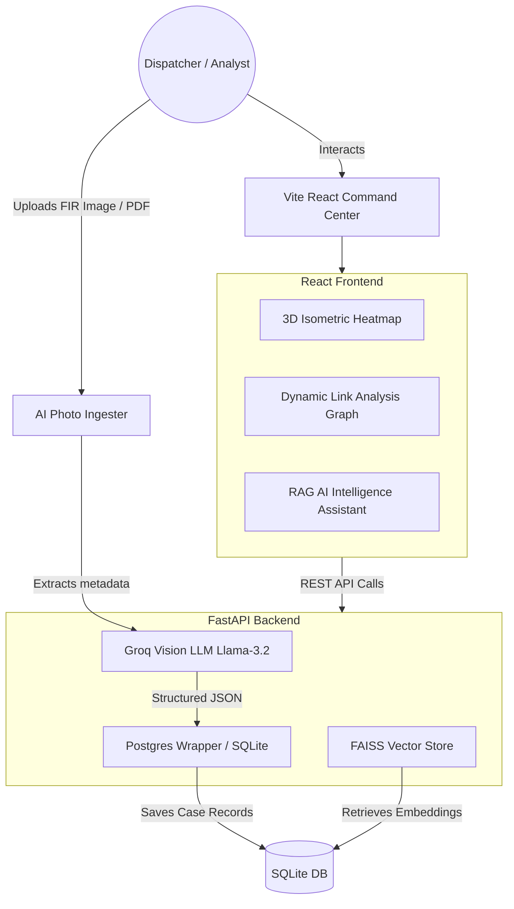

# CrimeCyclops — Next-Generation Crime Intelligence & Command Center

*Designed for the Karnataka State Police Datathon. CrimeCyclops is an advanced tactical command center that aggregates case intelligence, maps live spatial crime trends in 3D, performs network link analysis, and parses physical case documents using AI Vision.*

---

## Technical Demonstration
- **Deployment Platform**: [CrimeCyclops on Render](https://crimecyclops.onrender.com) *(Access credentials: admin / admin123)*

---

## Problem Statement
Modern police intelligence divisions are challenged by fragmented, unstructured data sources:
1. **Paper-Driven Workflows**: Valuable hours are expended manually transcribing physical First Information Reports (FIRs) and case documents.
2. **Undetected Associations**: Relational links between suspects, witnesses, and vehicles across multiple jurisdictions remain undetected due to the limitations of manual lookup.
3. **Static Mapping**: Traditional two-dimensional crime maps fail to convey density or frequency hierarchy, limiting immediate situational awareness for dispatchers.

---

## Platform Architecture


```mermaid
flowchart TD
    %% Users & Input
    User((Dispatcher / Analyst)) -->|Uploads FIR Image / PDF| Ingester[AI Photo Ingester]
    User -->|Interacts| UI[Vite React Command Center]

    %% Frontend & Visualizers
    subgraph UI_Panels [React Frontend]
        3DMap[3D Isometric Heatmap]
        Network[Dynamic Link Analysis Graph]
        Chatbot[RAG AI Intelligence Assistant]
    end
    UI --> UI_Panels

    %% Backend Layer
    subgraph API_Backend [FastAPI Backend]
        Parser[Groq Vision LLM Llama-3.2]
        FAISS[FAISS Vector Store]
        DB_Layer[Postgres Wrapper / SQLite]
    end
    
    Ingester -->|Extracts metadata| Parser
    Parser -->|Structured JSON| DB_Layer
    UI_Panels -->|REST API Calls| API_Backend
    
    %% Storage
    DB_Layer -->|Saves Case Records| SQL_DB[(SQLite DB)]
    FAISS -->|Retrieves Embeddings| SQL_DB
```

---

## Core Capabilities

### 1. Document Ingestion (AI Vision OCR)
- **Application**: Eliminates manual data entry of printed or handwritten case files.
- **Process**: Users upload an image of an FIR document. The system utilizes the **Groq Llama-3.2-11b-vision** model to extract key fields (District, Station, Crime Type, IPC Section, Incident Date, Status, Description) into structured JSON.
- **Resilience**: Features a local fallback parser that processes metadata from filename headers in the absence of an API key.
- **Synchronization**: Saving parsed records updates the database, prompting Leaflet to render the case position immediately.

### 2. 3D Isometric Mapping
- **Interface**: Glassmorphic layout flanking a central Leaflet container, utilizing Recharts for data density analytics (Donut, Bar, Line, and Radar components).
- **Data Rendering**: Employs CSS-styled vertical cylinders instead of traditional flat markers. Height and glow intensity are mapped to district crime density.
- **Geographic Coverage**: Displays spatial district boundary overlays for all major districts in Karnataka.
- **Tactical Effects**: Includes scanlines and background grid alignment overlays to simulate tactical dashboards.

### 3. Link Analysis Engine (Network Graph)
- **Relational Mapping**: Generates dynamic node graphs (SVG-based) representing interactions between Suspects, Victims, Witnesses, and FIR cases.
- **Context Highlighting**: Clicking any node centers first-degree relationships and loads case summaries in an inspector drawer.
- **Anomaly Detection**: Evaluates node degree centrality to flag repeat suspects or witness crossover instances.

### 4. Semantic Search (RAG Chatbot)
- **Natural Language Parsing**: Allows analysts to search for past events using conversational queries.
- **Information Retrieval**: Indexes case summaries into a **FAISS** vector store using Sentence Transformers (`all-MiniLM-L6-v2`) for semantic search.

---

## Technology Stack
- **Frontend**: Vite, React, TypeScript, Leaflet, Recharts, CSS Variables.
- **Backend**: FastAPI (Python), SQLite (optimized with a custom PostgreSQL compatibility wrapper), FAISS.
- **AI Models**: Groq Cloud API (`llama-3.2-11b-vision-preview`), HuggingFace Sentence Transformers (`all-MiniLM-L6-v2`).

---

## Installation & Deployment

1. **Configure Backend Environment**
   ```bash
   cd backend
   python -m venv venv
   source venv/bin/activate  # On Windows: .\venv\Scripts\activate
   pip install -r requirements.txt
   ```

2. **Generate Threat-Weighted Dataset**
   Populate the database with 16,000 mock cases across all 31 Karnataka districts and index the chatbot's vector store:
   ```bash
   python -c "import sys; sys.path.append('backend'); from app.seed_data import seed_demo_data; seed_demo_data()"
   ```

3. **Launch Backend Service**
   ```bash
   python -m uvicorn app.main:app --reload
   ```

4. **Initialize Frontend Application**
   ```bash
   cd ../frontend
   npm install
   npm run dev
   ```

5. **Authentication Credentials**
   Navigate to `http://localhost:5173` and log in:
   - **Username**: `admin`
   - **Password**: `admin123`

---

## Project Roadmap
- **PostGIS Extension**: Move from centroid plotting to spatial polygon intersection queries.
- **Kernel Density Estimation**: Implement predictive crime mapping using KDE algorithms.
- **ANPR System Integration**: Link license plate reader databases to the relational graph engine.
